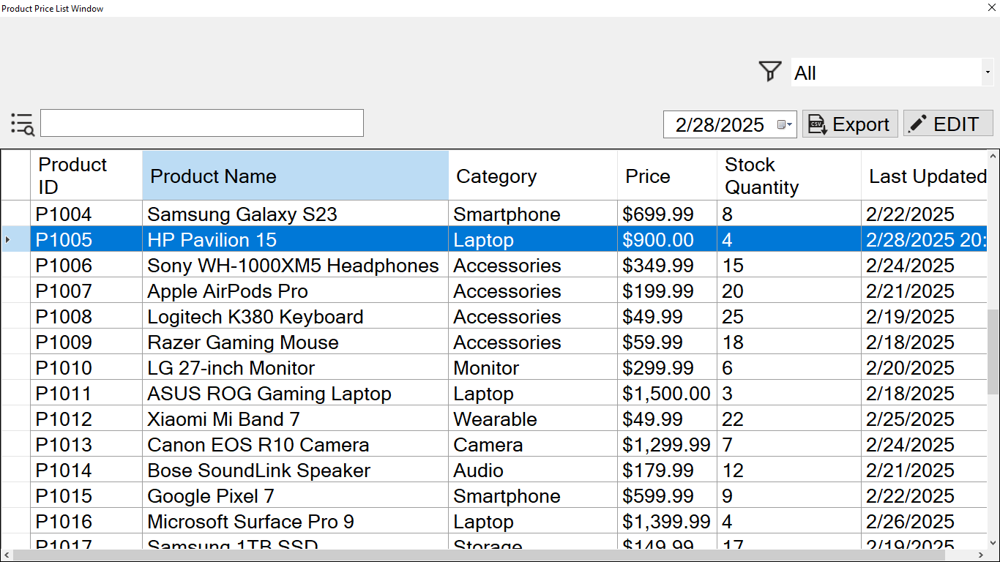
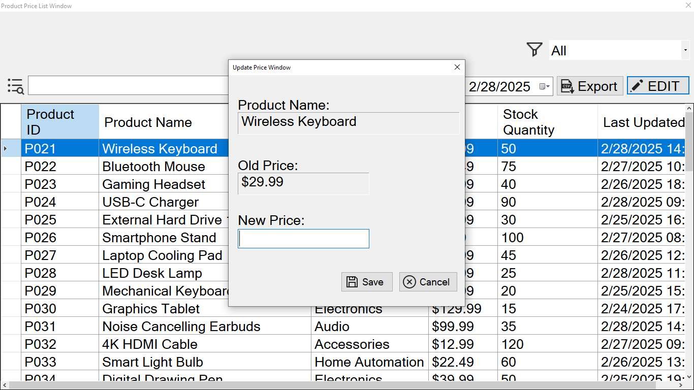

# Product Price List Manager

A **Windows Forms** application built with **C#** and **MSSQL**, designed to efficiently manage product price lists. This application allows users to **search**, **sort**, **update prices**, and **export data to CSV**, ensuring ease of use and smooth management of product pricing.

---

## Features

- **Search**: Easily search for products by name.
- **Sort**: Sort products by name, category, price, or stock quantity.
- **Update Prices**: Update product prices with real-time validation and confirmation prompts.
- **Export**: Export the product list to CSV with formatted data, including prices with a dollar sign and date in a readable format.
- **Data Validation**: Proper exception handling and data validation at every step.

---

## Screenshots

### 📌 Product List View


### 📌 Update Product Price


## Requirements

- **.NET Framework 4.7.2**
- **MSSQL Database**
- **Windows Operating System**

---

## Setup & Installation

1. Clone the repository to your local machine:

    ```sh
    git clone https://github.com/MasterWithAhmad/ProductPriceListManager.git
    ```

2. Open the project in **Visual Studio** or your preferred **C# IDE**.

3. Ensure you have an **MSSQL server** running and set up the **connection string** in the `app.config` file.

4. Build and run the application.

---

## Database Setup

The database `PriceListDB` contains the following table:

- **Products**: Stores product details, including ID, name, category, price, stock quantity, and last updated date.
  
---

## Usage

- **Main Form**: Displays a list of products with search, sort, and filter options.
- **Update Price**: Allows the user to update the price of selected products.
- **Export**: Users can export the current product list to a CSV file.

---

## Contributing

1. Fork the repository.
2. Create a new branch (`git checkout -b feature-name`).
3. Commit your changes (`git commit -m 'Add new feature'`).
4. Push to the branch (`git push origin feature-name`).
5. Create a new pull request.

---

## License

This project is licensed under the MIT License - see the [LICENSE](LICENSE) file for details.
